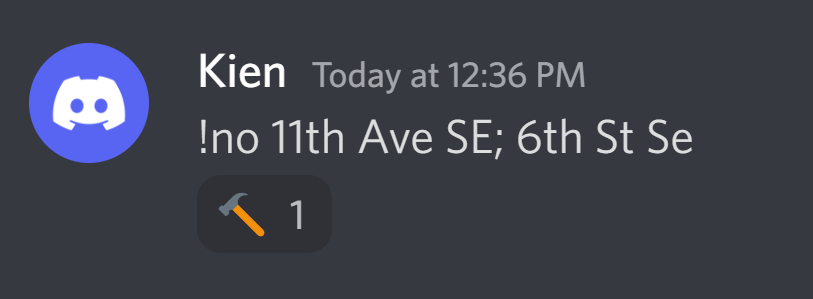

# safe-u-map

This program scrapes crime locations from [UMN Safe-U Alerts](https://publicsafety.umn.edu/alerts) and display the data as an [overlaid heatmap](https://pkien01.github.io/map.html). 

### How it works
* Descriptions, as well as dates, are scraped from new Safe-U Emergency cases using BeautifulSoup.
* Since the crime locations are not readily available, a name-entitiy recognition model (BERT NER) runs through the description and segment out phrases that identify as part of addresses. 
* The model might not fully reliable, so the result above is sent via discord for human inspection. The user can verify whether the extracted addresses are correct based on the descriptions. 
* All the addresses are aggregated and encoded into coordinates via Google Geocode API. These are displayed on Google Map as an overlaid heatmap showing the crime density of areas around the UMN campus. 
* The above procedures are repeated every 5 minutes to retrieve as new emergency cases are posted. Note that the data (including dates, descriptions, locations, and whether or not it has been verified) are stored as a pkl file so that the program doesn't have to recreate the data whenever it is restarted.

### How to install and use
* If you just want to look at the heatmap, skip to the last bullet point. If you want to update the heatmap with new alerts data and/or verify it, follow the steps below.
* Clone the repo: ```git clone https://github.com/pkien01/safe-u-map```
* Install the necessary enviroment (recommended to do this in conda or virtualenv): ```pip install -r requirements.txt```
* Create a discord bot by following the [instructions](https://www.freecodecamp.org/news/create-a-discord-bot-with-python/)
* Create a new file in the cloned ```safe-u-map``` folder and name it ```.env```. Put the following details in the file

```bash:
BOT_TOKEN="<GET THIS FROM DISCORD>"
API_KEY_WEB=<PLEASE REQUEST ME>
API_KEY_LOCAL=<PLEASE REQUEST ME>
USER_ID=<YOUR DISCORD USER ID>
```
* From the cloned folder's parent directory, run ```python -m safe_u```
* Please check your discord. Assuming you have never verify any crime locations' data, you should be able to see a message like this

* There are two ways to reply to this
    * If you think the extracted address(es) are correct, simply reply with ```!yes```
    * Otherwise, reply in the format of ```!no <ADDRESS 1>; <ADDRESS 2>; ....; <ADDRESS n>``` (note that the addresses can be typed in any order) </br>
    &ensp;
    * Also you can just assume every address is an address in Minneapolis, MN. If not, you can type the city name too (e.g. ``` 2017 Buford Ave, St Paul```)
* Navigate over the [heatmap](https://pkien01.github.io/map.html) and hopefully, it will be updated accordingly.


### Contacts
Since I cannot upload the API Keys freely to github, to request them, please shoot me an email at phamkienxmas2001@gmail.com. Thanks!


